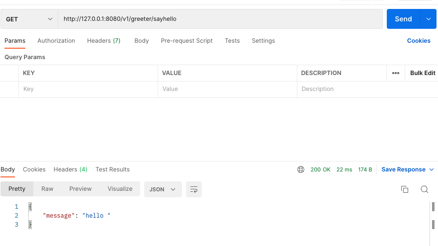

## 定义一个rcp服务 && grpc-gateway

<a href="https://github.com/grpc-ecosystem/grpc-gateway">grpc-gateway</a>
### gvm use go1.18.1

安装插件
```shell
go install \
    github.com/grpc-ecosystem/grpc-gateway/protoc-gen-grpc-gateway \
    github.com/grpc-ecosystem/grpc-gateway/protoc-gen-swagger \
    github.com/golang/protobuf/protoc-gen-go

wget https://github.com/protocolbuffers/protobuf/releases/download/v21.8/protoc-21.8-osx-aarch_64.zip
unzip protoc-3.2.0-linux-x86_64.zip -d protoc3
go install github.com/grpc-ecosystem/grpc-gateway/v2/protoc-gen-grpc-gateway@latest
```

编译文件
### 单纯rpc调用
```shell
./bin/protoc --go_out=./service user.proto
./bin/protoc --go_out=./service hello_world.proto
./bin/protoc --go_out ./service_rpc --go-grpc_out ./service_rpc hello_world_rpc.proto
go run rpc_demo/server.go
go run rpc_demo/client.go
```
  
### rpc转化为http
```shell
./bin/protoc -I. -I=./third_party  -I=./include \
  --go_out=./service_rcp_http --go_opt=paths=source_relative \
  --go-grpc_out=./service_rcp_http --go-grpc_opt=paths=source_relative \
  --grpc-gateway_out=./service_rcp_http --grpc-gateway_opt=paths=source_relative \
  ./hello_world.proto
go run rpc_http_demo/server.go
```

### 最终请求
